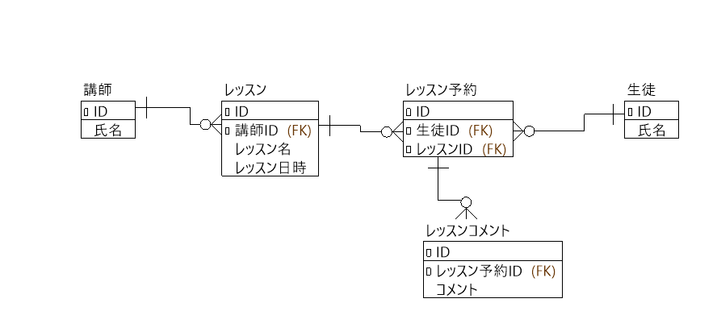
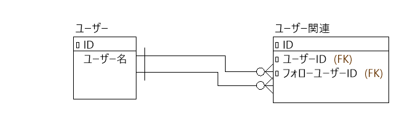
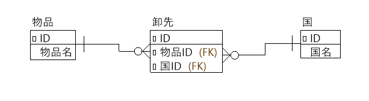
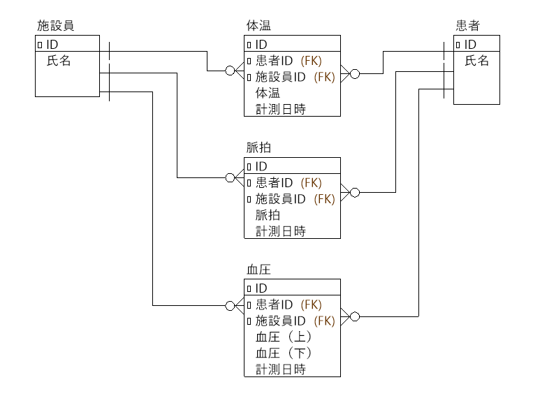
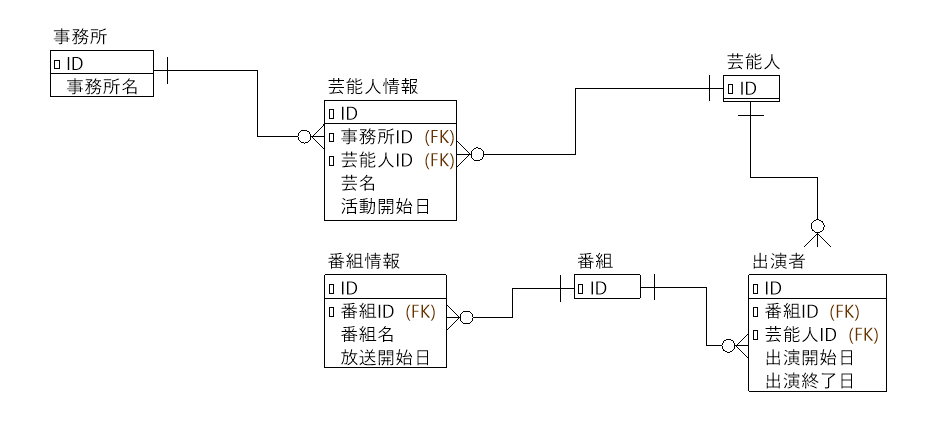

# データモデリング入門の回答

## 課題1

- ER図

- 説明
  - 講師は講師テーブルに登録されます。
  - 生徒は生徒テーブルに登録されます。
  - 講師がレッスンを登録するというイベントをトリガーにレッスンテーブルにレッスンが追加されます。レッスンにはレッスン名と日時を設定可能です。
  - 生徒がレッスンを予約するというイベントをトリガーにレッスン予約テーブルに予約が追加されます。
  - 生徒がレッスンをキャンセルするというイベントをトリガーに、レッスン予約テーブルの予約が削除されます。
  - 講師がレッスンを受けた生徒に対してコメントをするというイベントをトリガーに、レッスンコメントテーブルにコメントが登録されます。

## 課題2

- ER図

- 説明
  - ユーザーはユーザーテーブルに登録されます。
  - ユーザーが他のユーザーをフォローするというイベントをトリガーに、ユーザー関連テーブルにそのデータが追加されます。
  - ユーザー関連テーブルはユーザーIDとフォローユーザーIDという2つの外部キーを持ち、どちらもユーザーテーブルを参照しています。
  - ユーザーIDをキーとしてユーザー関連テーブルを絞り込んだ場合、そのユーザーがフォローしているユーザーのデータを取得できます。
  - フォローユーザーIDをキーとしてユーザー関連テーブルを絞り込んだ場合、そのユーザーをフォローしているユーザー（フォロワー）のデータを取得できます。
## 課題3

- ER図

- 説明
  - 物品は物品テーブルに登録されます。
  - 国は国テーブルに登録されます。
  - どの物品をどの国に卸していいかという対応は卸先テーブルに登録されます。

## 課題4

- ER図

- 説明
  - 施設員は施設員テーブルに登録されます。
  - 患者は患者テーブルに登録されます。
  - 施設員が患者の体温を計測するというイベントをトリガーに体温テーブルにデータが追加されます。
  - 施設員が患者の脈拍を計測するというイベントをトリガーに脈拍テーブルにデータが追加されます。
  - 施設員が患者の血圧を計測するというイベントをトリガーに血圧テーブルにデータが追加されます。
  - 誰が計測したかは各計測項目の施設員IDから取得できます。
  - 患者の最新の計測データは各計測項目のテーブルの計測日時が最新のものを取得することで参照可能です。
  - 体温と脈拍は同時に計測されますが、テーブルとしては分けたほうが構造がシンプルでわかりやすいと感じたため分けました。今後計測する項目が増えていった場合も同様にテーブルを追加していくだけなので変更に強いのではないかと思います。

## 課題5

- ER図

- 説明
  - 芸能人は事務所に所属すると芸能人情報テーブルにデータが追加されます。
  - 追加される際は、芸名と活動開始日が必要です。
  - 芸名が変わったり、所属事務所が変わったりすると、同じ芸能人IDで芸能人情報テーブルに新たにデータが追加されます。活動開始日には変更された日付が入ります。
  - 活動開始日が最新日の芸能人情報がその芸能人の現在の情報となります。
  - 番組は放送が開始されると番組情報テーブルにデータが追加されます。
  - 番組情報テーブルには番組名と放送開始日が入ります。
  - 番組名が変わる場合は、同じ番組IDで番組情報テーブルに新たにデータが追加されます。放送開始日には変更された日付が入ります。
  - 放送開始日が最新の番組情報がその番組の現在の情報となります。
  - 番組にどの芸能人が出ているかは出演者テーブルで管理されます。
  - 出演者テーブルには番組IDと芸能人IDのほか、出演開始日と終了日が入ります。
  - 出演終了日はデータが作成されたタイミングでは空ですが、芸能人が降板となったタイミングでデータが更新され、出演終了日に日付が入ります。
  - これらのデータ構造により、ある時点でのレギュラー出演している芸能人を、そのときの名前、そのときの所属事務所で把握することができます。